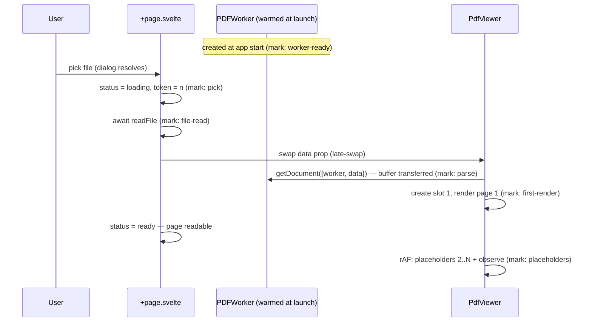
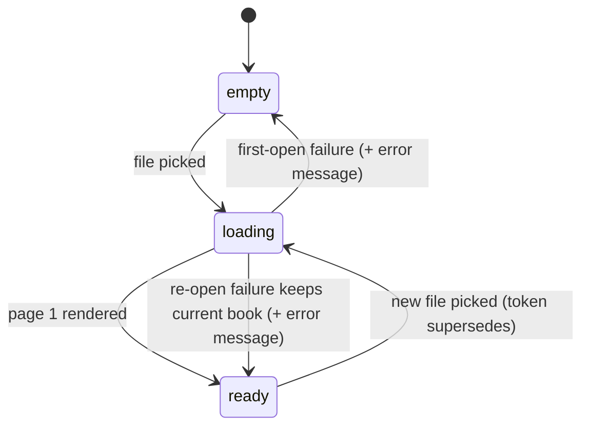

# perf: Fast PDF open path

## Summary

Make the file-pick → readable-page path fast and visibly responsive: add timing marks across the load pipeline, replace the binary empty/viewer toggle with a load state machine that shows a loading state immediately, warm the pdf.js worker at app launch, hand the file buffer to pdf.js without a copy (reworking the spread toggle to reuse the parsed document), and render page 1 before bulk placeholder work.

---

## Problem Frame

Opening the gamebook leaves the viewer blank/white for several seconds despite the PDF being under 10MB. The pipeline is strictly sequential (full file read → in-memory copy → worker spawn → parse → all-page placeholder DOM → first render), nothing is warmed before the file pick, no stage has ever been timed, and no loading or error UI exists. Slowness has mostly been observed in dev mode; success is judged on a release build (see origin: docs/brainstorms/2026-07-17-pdf-load-performance-requirements.md).

---

## Requirements

Carried from origin (R1–R7), plus two hardening requirements the load-state work exposes.

**Instrumentation & baseline**

- R1. The load pipeline emits timing marks for each stage: worker readiness, file read, document parse, page-1 render, placeholder construction.
- R2. A one-time dev-vs-release timing comparison is recorded, establishing where the wait lives.

**Perceived speed**

- R3. Picking a file shows a loading state in the viewer area within ~100ms.
- R4. Page 1 renders before placeholder construction for the remaining pages.

**Pipeline wins**

- R5. The pdf.js worker is created at app launch; no worker-startup cost sits inside the post-pick window, on first or subsequent opens.
- R6. The file buffer is passed to pdf.js without a defensive copy; pdf.js transfers ownership to its worker.

**Hardening (new)**

- R8. Load failures (unreadable file, corrupt PDF) surface an inline error message; a failed re-open never destroys a currently working book view.
- R9. A file pick that starts while a previous load is in flight supersedes it cleanly — the last-picked book always wins and stale loads never write UI state.

**General**

- R7. Low-risk free wins found while in the code may be taken opportunistically, behavior preserved (see Scope Boundaries).

---

## Key Technical Decisions

- **Instrumentation ships in release builds.** Marks use `performance.mark`/`performance.measure` plus a single summary log per load, in a small standalone module so removal is one import away. Dev-gating would make the release-build criterion unmeasurable.
- **One `PDFWorker` singleton for the app's lifetime.** Created (and its `promise` awaited) at launch from a shared module; every `getDocument` call receives it via `{ worker }`. pdf.js v6 otherwise spawns a worker per `getDocument` call.
- **Buffer is transferred, not copied.** pdf.js v6 detaches the `ArrayBuffer` into the worker. Consequence: the bytes are unusable after `getDocument`, so the spread toggle must stop re-calling `load(data)` and instead rebuild only the DOM/placeholder grid from the existing `PDFDocumentProxy`.
- **Explicit load state machine in the page.** `"empty" | "loading" | "ready"` plus a `loadError` string (mirroring the `loadError` pattern in `solo-rpg-companion/src/lib/AudioPlayer.svelte`). Late-swap: the viewer's `data` prop only changes after `readFile` succeeds, so read failures leave a working book untouched; parse/render failures inside the viewer are reported up via an `onerror` callback prop.
- **Supersession by token, loads serialized on the shared worker.** `openBook()` and `load()` capture a monotonic token and bail after each `await` if superseded (the stale-key-after-await pattern in `solo-rpg-companion/src/lib/BookmarkRail.svelte`). A new `getDocument` waits for the previous task's teardown to settle first — destroying a task on a shared worker can disturb other in-flight tasks on it (pdf.js issue #16777).
- **Loading state is indeterminate.** `loadingTask.onProgress` fires exactly once for in-memory data, so no progress bar; the loading UI is a CSS-keyframe pulse with a `prefers-reduced-motion` fallback, matching the app's animation conventions.

---

## High-Level Technical Design

New open pipeline (marks in parentheses):

Page-level state machine:

---

## Implementation Units

### U1. Timing instrumentation across the load pipeline

- **Goal:** Every load emits stage timings; a dev-vs-release baseline is captured before any optimization lands.
- **Requirements:** R1, R2.
- **Dependencies:** none — lands first so later units are measured against a baseline.
- **Files:** `solo-rpg-companion/src/lib/perf.ts` (new), `solo-rpg-companion/src/routes/+page.svelte`, `solo-rpg-companion/src/lib/PdfViewer.svelte`.
- **Approach:** Small module wrapping `performance.mark`/`performance.measure` with a `summarize()` that logs one table per completed load. Marks: pick, file-read, parse, first-render, placeholders (worker-ready added in U3). No behavior change.
- **Test scenarios** (manual — no test framework exists in this repo):
  - Open the gamebook in `npm run tauri dev`; one summary with all stage durations appears per load, and totals match the felt wait.
  - Covers AE2 (partial). Build a release app (`npm run tauri build`), open the same PDF, record both timing sets side by side in the commit or PR description.
  - Open two different PDFs in a row; each load emits exactly one summary, no accumulation.
- **Verification:** `npm run check` passes; the recorded dev-vs-release comparison exists and identifies the dominant stage.

### U2. Load state machine, loading UI, and error handling

- **Goal:** The viewer area is never silently blank: picking a file shows a loading state immediately, failures show an inline message, and a failed re-open keeps the current book.
- **Requirements:** R3, R8, R9 (page half — viewer half in U4).
- **Dependencies:** none.
- **Files:** `solo-rpg-companion/src/routes/+page.svelte`.
- **Approach:** Replace the `{#if pdfData}` binary with `status: "empty" | "loading" | "ready"` + `loadError`. Set `status = "loading"` synchronously when the dialog resolves with a path, before `await readFile`. Monotonic token in `openBook()`; stale completions bail. Late-swap `pdfData`. `PdfViewer` gains an `onready`/`onerror` callback pair; `onready` (page 1 rendered) flips to `ready`. While loading a first book, hide BookmarkRail and page/spread chrome; while re-opening over an existing book, keep the current view with a small loading indicator in the chrome. Loading skeleton: dimmed pulsing page-shaped block, component-scoped styles, `prefers-reduced-motion` static fallback, palette per existing chrome (`rgba(28,24,21,0.82)` panels, `#c9a35c` accent).
- **Test scenarios** (manual):
  - Covers AE1. Pick a PDF from the empty state: skeleton appears near-instantly (well under 100ms), then page 1 replaces it without a blank/white gap.
  - Cancel the file dialog from empty state and from an open book: no state change either way.
  - Pick a nonexistent/locked file path (e.g., delete a file after noting its path, reopen via a stale picker entry if reproducible, or temporarily throw in `readFile`): inline error shows; a previously open book stays rendered and usable.
  - Rapid double-open: pick book A, immediately pick book B before A renders — B loads and renders; no flash of A, no console errors.
- **Verification:** `npm run check` passes; all four scenarios behave as described in a dev run and spot-checked in release.

### U3. Warm the pdf.js worker at app launch

- **Goal:** Worker fetch/compile/spawn/handshake cost moves out of the post-pick window.
- **Requirements:** R5.
- **Dependencies:** U1 (so the win is visible in the marks).
- **Files:** `solo-rpg-companion/src/lib/pdfWorker.ts` (new), `solo-rpg-companion/src/lib/PdfViewer.svelte`, `solo-rpg-companion/src/routes/+layout.ts` or `+page.svelte` module scope (earliest SPA seam — no `+layout.svelte` or `onMount` exists).
- **Approach:** Shared module sets `GlobalWorkerOptions.workerSrc`, creates one `PDFWorker`, exposes the instance and its readiness promise; mark `worker-ready` when the handshake resolves. `PdfViewer.load()` passes `{ worker }` to `getDocument`. Worker is never destroyed on document swap — only the loading task/document are.
- **Test scenarios** (manual):
  - Covers AE2. After launch, wait a beat, open the PDF: parse mark shows no worker-spawn component; compare against U1 baseline.
  - Open a file immediately after launch (before warm-up likely finished): load still succeeds (getDocument awaits the same worker promise), no race error.
  - Open two documents in a row: second open reuses the worker (no new worker spawn visible in timings).
- **Verification:** `npm run check` passes; post-pick time drops by the measured worker-spawn cost from the U1 baseline.

### U4. Transfer the buffer and rework the spread toggle

- **Goal:** No full-buffer copy on the main thread; spread toggle works on the already-parsed document; in-flight loads are serialized and supersedable.
- **Requirements:** R6, R9 (viewer half).
- **Dependencies:** U3 (shared worker in place), U2 (onerror channel exists).
- **Files:** `solo-rpg-companion/src/lib/PdfViewer.svelte`.
- **Approach:** Drop `bytes.slice()`; pass the prop bytes directly — the buffer detaches, so nothing may touch `data` after `getDocument`. Split `load()` into parse (`getDocument` → `doc`) and layout (placeholder/DOM build from `doc`); `setSpread()` calls only the layout half. Sync the internal `spread` flag even when `!doc` so a toggle during load applies to the finishing load; disable the spread button while not ready. Token guard after each `await` in `load()`; a superseding load awaits the previous task's `destroy()` before issuing its own `getDocument`.
- **Test scenarios** (manual):
  - Toggle spread after a book loads: layout switches to facing pairs and back with no re-parse (parse mark does not re-fire) and no detached-buffer error.
  - Toggle spread while a load is in flight: no crash; the finishing load lays out per the latest toggle state.
  - Rapid double-open (same as U2 scenario): no `getDocument` failure from teardown racing the shared worker.
  - Open a book, verify memory: no second full-size buffer retained on the main thread (heap snapshot or rough footprint comparison against baseline).
- **Verification:** `npm run check` passes; spread behavior identical to pre-change from the user's perspective.

### U5. Render page 1 before bulk placeholder work

- **Goal:** A readable page appears as early as the pipeline allows; O(numPages) DOM work happens after first paint.
- **Requirements:** R4.
- **Dependencies:** U4 (load() already split into parse/layout).
- **Files:** `solo-rpg-companion/src/lib/PdfViewer.svelte`.
- **Approach:** In the layout half: create slot 1's placeholder and `Slot` object first, render page 1 into it eagerly, fire `onready`, then build placeholders 2..N behind `requestAnimationFrame` and `io.observe` only slots not already rendered (`if (slot.rendered) continue`). The existing `slot.task` guard prevents double-render if the observer fires anyway.
- **Test scenarios** (manual):
  - Covers AE1. Open the gamebook: page 1 is readable before the scrollbar reflects the full page count (placeholders arrive a frame later).
  - Scroll immediately after page 1 appears: pages 2+ render lazily as before, no missing or permanently blank slots.
  - Spread mode on before opening: cover renders alone first, facing pairs build correctly after.
  - Jump to a bookmark right after load: navigation lands on the right page and it renders.
- **Verification:** `npm run check` passes; first-render mark moves ahead of the placeholders mark in the U1 timings; release build meets the ~1s readable-page criterion or the remaining gap is attributed to a named stage.

---

## Scope Boundaries

Deferred, pending the R2 evidence (carried from origin):

- Tauri asset-protocol / streaming delivery of the PDF (range reads instead of full in-memory load).
- Cached first-paint snapshot per book.

Out of scope:

- Auto-resume of last book and page.
- Changes to the lazy page rendering strategy (IntersectionObserver lookahead) beyond the observe-skip in U5.
- Adding a test framework — verification stays manual plus `npm run check` for this plan.

Opportunistic free wins (R7): allowed while touching a file anyway, behavior-preserving only (e.g., dropping unused work in the load path); anything structural goes here as a follow-up instead.

---

## Risks & Dependencies

- **Detached-buffer regressions.** Any code path that reads `data` after `getDocument` now gets a zero-length buffer. Mitigation: U4 removes the only known consumer (spread toggle); the U4 scenarios exercise it.
- **JPX images bypass warm-up.** If the gamebook contains JPEG-2000 images, the first page needing one pays a lazy `openjpeg.wasm` fetch that worker warm-up cannot pre-pay (pdf.js v6 loads it on first decode). If U1 timings show this, note it; pre-fetching the wasm is a possible follow-up, not in scope.
- **Dev-mode overhead may dominate.** If the release build already meets the ~1s criterion at baseline, U3–U5 are still cheap and correct, but the user-facing win mostly comes from U2's loading state; record that outcome honestly against R2.

---

## Sources

- Origin requirements: docs/brainstorms/2026-07-17-pdf-load-performance-requirements.md.
- Verified load-path quotes: `solo-rpg-companion/src/routes/+page.svelte:52-61`, `solo-rpg-companion/src/lib/PdfViewer.svelte:54-61, 73-93, 117-153`.
- pdf.js v6 source (`src/display/api.js`, tag v6.1.200): `PDFWorker` pre-creation and `getDocument({worker})` reuse; `data` buffer passed in a postMessage transfer list (detaches); `loadingTask.promise` resolves at catalog parse, `getPage` is lazy; `onProgress` fires once for in-memory data; `disableAutoFetch`/`rangeChunkSize` inert for the in-memory path. https://github.com/mozilla/pdf.js/blob/v6.1.200/src/display/api.js
- Shared-worker destroy interaction: https://github.com/mozilla/pdf.js/issues/16777. Detach-on-transfer field report: https://github.com/wojtekmaj/react-pdf/issues/1657. Lazy `openjpeg.wasm`: https://github.com/mozilla/pdf.js/pull/19340.
- Repo patterns: stale-key-after-await (`solo-rpg-companion/src/lib/BookmarkRail.svelte:43-48`), `loadError` UI (`solo-rpg-companion/src/lib/AudioPlayer.svelte`), reduced-motion opt-outs in all animated components.
