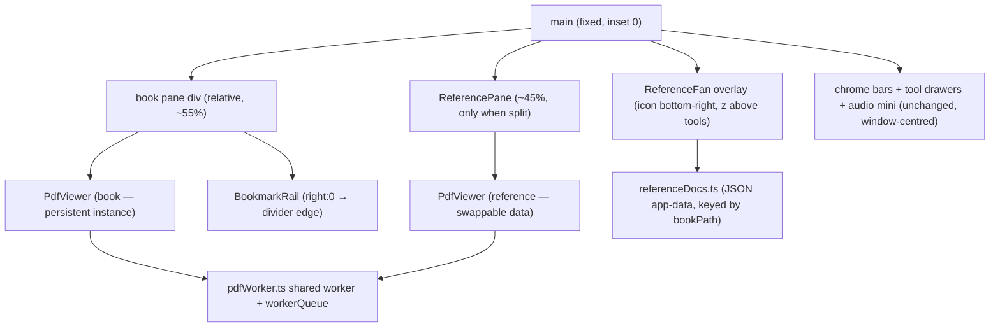
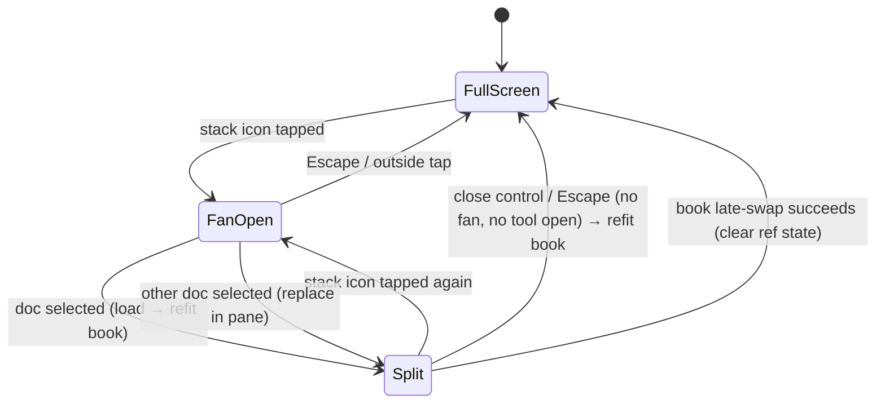

# feat: Reference documents — paper-stack fan and split reader

## Summary

Add per-book sets of small, read-only reference PDFs. A paper-stack icon in the bottom-right fans the current book's references over the dimmed page; selecting one splits the screen — gamebook left, reference right, opened at page 1. Sets persist per book file path using the bookmarks JSON pattern. One adjacent viewer change is pulled in: `PdfViewer` learns to re-fit when its container width changes, which the split requires.

---

## Problem Frame

Mid-session references (oracle tables, playkit pages) live as printouts on the desk — clutter the app exists to absorb. The app is single-document today: opening another PDF replaces the gamebook. See origin for full framing (see origin: docs/brainstorms/2026-07-17-reference-documents-requirements.md).

---

## Requirements

Origin requirements R1–R12 carry forward verbatim (summoning R1–R3, split view R4–R9, set management R10–R12), as do flows F1–F2 and acceptance examples AE1–AE3. Planning adds:

**Viewer and layout**

- R13. Opening or closing the split re-fits the book to its new pane width; position is preserved at page granularity (the viewer re-anchors to the top of the current page). This is the honest reading of origin R7 given the viewer's anchor mechanism.
- R14. The split ratio is fixed and book-favoring (~55/45); the divider is not draggable.

**Failure isolation**

- R15. The reference pane owns its loading state (skeleton placeholder) and its error state (inline message + close control). A reference PDF that is corrupt, encrypted, or unreadable never affects the book's state.

**Input and lifecycle**

- R16. Escape dismisses one layer per press with fixed precedence: fan, then open tool drawer, then split pane. A single coordinator owns this ordering; no double-dismiss.
- R17. The paper-stack icon is gated on `viewerReady`, like the rest of the chrome; the fan closes if the viewer becomes not-ready.
- R18. Book-swap closes the split only at the late-swap moment (when the new book's data replaces the old); a cancelled dialog or failed read leaves the split intact.
- R19. Selecting the reference doc already open is a no-op that dismisses the fan; removing the currently-open doc also closes the pane; adds dedupe silently by file path.

---

## Key Technical Decisions

- **The book's viewer instance survives the split untouched.** `getDocument` transfers the PDF buffer to the worker, leaving `pdfData` detached — a remount would re-load a dead buffer and fail. The layout restructures around the persistently mounted `PdfViewer`; no `{#key}`/`{#if}` may recreate it.
- **`PdfViewer` gains an exported `refit()`** that re-runs `computeFit()` and the existing anchor-preserving `rescale()` shape. Called from the page after the split toggles (post-layout, e.g. `requestAnimationFrame`). No ResizeObserver machinery beyond what the split needs.
- **Book pane becomes the rail's positioned ancestor.** Wrapping `PdfViewer` + `BookmarkRail` in a `position: relative` book-pane div moves the tabs to the divider with zero rail changes (origin R9). Chrome bars, tool drawers, and the audio mini-bar stay direct children of `main`, so tools keep working over both panes (origin R8) with existing z-indexes.
- **Reference pane errors are pane-scoped.** The existing `onViewerError` path nulls the book state and must not be reused; the pane wires its own `onerror` into an inline error UI.
- **Escape gets one owner.** A page-level coordinator dismisses the topmost layer and prevents the tools' independent `svelte:window` listeners from also firing (mechanism — capture-phase listener or an open-layer guard — is implementation's choice; the contract is R16's one-layer-per-press).
- **Persistence clones `bookmarks.ts`.** `referenceDocs.ts`: one JSON file in app data keyed by book path, `{ name, path }` entries, save on every mutation, localStorage fallback for browser dev.
- **Missing-file badges probe on fan open.** Extend the `fs:allow-exists` capability to `$HOME/**` and `/Volumes/**` (one-line change) and probe entries asynchronously each time the fan opens; a file that passes the probe but fails to read falls into the R15 error path.
- **Verification is manual + `svelte-check`.** The repo has no test runner; introducing one is out of scope (deferred). Test scenarios below are manual unless noted.

---

## High-Level Technical Design

Layout and ownership after the change — the book pane wraps viewer and rail; overlays stay window-level:

Split lifecycle — the transitions the page must coordinate (directional guidance, not specification):

---

## Implementation Units

### U1. Reference-set store

- **Goal:** Persist each book's reference-doc list across launches.
- **Requirements:** origin R10, R11; R19 (path dedupe).
- **Dependencies:** none.
- **Files:** `solo-rpg-companion/src/lib/referenceDocs.ts` (new).
- **Approach:** Clone `src/lib/bookmarks.ts`: `RefDoc = { name, path }`, `loadRefDocs(bookKey)` / `saveRefDocs(bookKey, list)`, `refdocs.json` in `appDataDir()`, read-modify-write with recursive `mkdir`, localStorage fallback outside Tauri. Name derivation mirrors `AudioPlayer.defaultPickFiles` (strip path + extension, handle Windows backslashes like `bookmarks.ts` does).
- **Patterns to follow:** `src/lib/bookmarks.ts` (structure, dual-path persistence), `src/lib/audioStore.ts` (list-shaped state).
- **Test scenarios** (manual, browser dev + Tauri):
  - Save two docs for book A, restart, load returns both in order.
  - Save under book A, open book B — load returns empty for B, A's set intact.
  - Add the same path twice — list holds one entry.
  - Browser dev (no Tauri): set survives page reload via localStorage.
- **Verification:** `npm run check` passes; the four scenarios above hold.

### U2. PdfViewer refit and perf-noise gating

- **Goal:** The viewer can re-fit to a changed container width, preserving the current page; a second viewer instance doesn't corrupt load-perf marks.
- **Requirements:** R13.
- **Dependencies:** none.
- **Files:** `solo-rpg-companion/src/lib/PdfViewer.svelte`.
- **Approach:** Export `refit()`: guard on loaded doc, capture current page as anchor, re-run `computeFit()`, apply the `rescale()` resize path, `goToPage(anchor)`, re-observe slots — the same anchor-preserving shape `setSpread` uses. Gate the module-global `perf.mark`/`perf.summarize` calls behind a prop (e.g. `perfLog = true`, reference pane passes false) so a second instance doesn't emit broken load summaries.
- **Test scenarios** (manual):
  - Load a book, narrow the container (dev-tools), call `refit()` — pages re-fit to the new width, view lands at the top of the same page, zoom percentage preserved relative to new fit.
  - `refit()` before any document is loaded is a no-op, no error.
  - With two viewers mounted, console shows load-perf output only for the book.
- **Verification:** `npm run check` passes; scenarios hold; no behavior change for the existing single-viewer flow.

### U3. Split-pane layout

- **Goal:** The page hosts a book pane and an optional reference pane without ever remounting the book's viewer; bookmark tabs land on the divider.
- **Requirements:** origin R4, R7, R8, R9; R13, R14.
- **Dependencies:** U2.
- **Files:** `solo-rpg-companion/src/routes/+page.svelte`.
- **Approach:** Wrap `PdfViewer` + `BookmarkRail` in a `position: relative` book-pane div sized by a `splitOpen` state (100% ↔ ~55%); a sibling pane div holds the reference viewer. Toggle via width/flex changes only — never conditional blocks around the book viewer. Call `viewer.refit()` after the layout settles on both open and close. Chrome bars, tool drawers, and audio mini-bar remain direct children of `main`.
- **Technical design:** see the layout diagram in High-Level Technical Design.
- **Test scenarios** (manual):
  - Open split with a hardcoded second PDF: book re-fits to the narrow pane, stays on the same page; close restores full width and re-fits back.
  - Bookmark tabs render on the divider while split; clicking one still jumps the book.
  - Covers F1 (partial): dice tray opens and rolls over both panes while split; audio mini-bar stays reachable.
  - Spread mode while split renders without error (two book pages in the narrow pane is acceptable).
- **Verification:** book viewer instance is never destroyed across repeated split toggles (no re-load in console); scenarios hold.

### U4. Reference pane

- **Goal:** A self-contained right pane that loads, shows, and fails independently of the book.
- **Requirements:** origin R4, R5, R6; R15.
- **Dependencies:** U2, U3.
- **Files:** `solo-rpg-companion/src/lib/ReferencePane.svelte` (new), `solo-rpg-companion/src/routes/+page.svelte`.
- **Approach:** Wraps a second `PdfViewer` (`perfLog` off). Given a doc path: read file via plugin-fs, pass bytes; skeleton placeholder while loading; on `onerror`, inline pane-scoped error message + close control — book state untouched. Swapping the path reuses the same viewer instance (its `load()` already tears down through `workerQueue`). Close button top corner, matching chrome styling. Fit-width only, scrollable, no page chrome, no bookmarks.
- **Patterns to follow:** `.skeleton` placeholder and `.error` styling in `src/lib/PdfViewer.svelte` / `+page.svelte`; chrome opacity conventions.
- **Test scenarios** (manual):
  - Covers AE1. Playkit open; selecting the expansion replaces the pane content; book untouched.
  - A zero-byte or corrupt PDF shows the pane error with close control; the book keeps rendering and scrolling.
  - Slow/large file shows skeleton until first page renders.
  - Close mid-load aborts cleanly (no console errors, book unaffected).
- **Verification:** book state (`pdfData`/`bookPath`) provably unchanged through every pane failure path.

### U5. Paper-stack icon and fan

- **Goal:** Summon, browse, add, remove, and badge the book's reference set.
- **Requirements:** origin R1, R2, R3, R10, R12; R17.
- **Dependencies:** U1; U4 for selection wiring.
- **Files:** `solo-rpg-companion/src/lib/ReferenceFan.svelte` (new), `solo-rpg-companion/src/routes/+page.svelte`, `solo-rpg-companion/src-tauri/capabilities/default.json`.
- **Approach:** Stack icon bottom-right, gated on `viewerReady`, low-opacity chrome styling. Tap → fan of document cards over a dimming backdrop (z-index above tool drawers); outside-tap dismisses (Escape via U6). Cards: name, remove affordance, missing badge; an add card opens the multi-select PDF dialog (`multiple: true`, normalize result, dedupe by path). Empty set renders the add affordance as the fan body (origin R3). On fan open, probe each entry with `fs.exists` asynchronously; extend `fs:allow-exists` scope to `$HOME/**` and `/Volumes/**`. Missing entries are selectable-for-removal only.
- **Patterns to follow:** `AudioPlayer.defaultPickFiles` for the dialog; tool-drawer overlay positioning and backdrop conventions.
- **Test scenarios** (manual):
  - Covers F2 / AE2 (setup half). New book: fan shows add affordance; picking two PDFs populates and persists; reopening the app restores them.
  - Covers AE3. Delete a file on disk; fan open shows the missing badge; removal works; other docs open.
  - Fan open/dismiss leaves the book's scroll untouched.
  - Adding a duplicate path changes nothing visible.
  - Adding the currently-open gamebook as a reference works (separate bytes, separate load).
- **Verification:** capability change is exactly the `fs:allow-exists` scope addition; probe failures never block the fan (origin R12).

### U6. Lifecycle and Escape coordination

- **Goal:** The edge semantics: one-layer-per-press Escape, book-swap timing, same-doc and remove-while-open behavior.
- **Requirements:** origin AE2; R16, R18, R19.
- **Dependencies:** U3, U4, U5.
- **Files:** `solo-rpg-companion/src/routes/+page.svelte` (coordinator), possibly small guards in tool components if the chosen mechanism needs them.
- **Approach:** Page-level Escape coordinator with precedence fan → open tool → split pane, one layer per press; must prevent the tools' existing independent `svelte:window` listeners from double-firing (capture-phase interception or shared open-layer guard — implementer's choice). Book-swap: clear reference state and close the split inside the existing late-swap block in `openBook()` — not at pick time — so cancelled dialogs and failed reads keep the split (R18). Fan selection of the already-open doc dismisses the fan without reloading; removing the open doc also closes the pane.
- **Test scenarios** (manual):
  - Covers R16. Fan open over an open dice tray: first Escape closes only the fan; second closes only the tray; third closes the split.
  - Covers AE2 / R18. While split, Open → cancel dialog: split intact. Open → valid book: split closes exactly when the new book appears, fan now shows the new book's (empty) set.
  - Covers R19 / AE1. Reselecting the open doc: pane content and scroll position unchanged, fan dismissed. Removing the open doc: pane closes, book re-fits to full width.
  - Escape with nothing open does nothing (no tool side effects).
- **Verification:** every scenario passes in Tauri (`npm run tauri dev`); `npm run check` clean.

---

## Scope Boundaries

Carried from origin: character sheets stay paper (no fillable/annotation support); no navigation aids inside reference docs; pinned region clips remain a separate future idea; custom rollable tables are a distinct feature; no global document library.

### Deferred to Follow-Up Work

- Test infrastructure (vitest for `referenceDocs.ts` would be the repo's first runner) — deliberate scope decision, revisit if manual verification starts missing regressions.
- Draggable divider / adjustable split ratio.
- Pixel-accurate scroll restore across refits (page-accurate shipped; would need viewer scroll-offset math).
- General ResizeObserver-based reflow on window resize (only the split toggle re-fits in this plan; window-resize reflow is the same `refit()` wired to an observer later).
- Hardening `workerQueue.settled` from single-slot to chained promises — do opportunistically in U4 if the close-split-while-opening-book race shows up in testing; otherwise follow-up.

---

## Risks & Dependencies

- **Shared pdf.js worker.** Two live documents on one warmed worker is supported and anticipated by `src/lib/pdfWorker.ts` ("across viewer instances"), but `workerQueue.settled` is a single slot: near-simultaneous teardowns (closing the split while opening a new book) could overwrite each other's promise. U6's AE2 scenario exercises exactly this; harden if it flakes.
- **Detached-buffer trap.** Any future refactor that conditionally remounts the book viewer breaks on the transferred buffer. The U3 verification (no re-load across toggles) is the guard.
- **Small-docs assumption.** Every reference open re-reads from disk (nothing caches; buffers are detached). Fine for few-page PDFs; a large reference doc degrades open-speed — accepted per origin's assumption.
- **Canvas memory.** Both viewers evict off-screen canvases independently (IntersectionObserver + unrender); doubling is bounded to visible + lookahead pages. Low risk.

---

## Sources & Research

- `docs/brainstorms/2026-07-17-reference-documents-requirements.md` — origin; R1–R12, F1–F2, AE1–AE3.
- `solo-rpg-companion/src/lib/pdfWorker.ts` — warmed worker + `workerQueue` serialization contract.
- `solo-rpg-companion/src/lib/PdfViewer.svelte` — buffer transfer on `getDocument`; `computeFit()` only runs in `buildLayout()`; `rescale()` anchor idiom `refit()` extends; no ResizeObserver exists anywhere in the repo.
- `solo-rpg-companion/src/lib/bookmarks.ts` — persistence template (JSON app-data + localStorage fallback).
- `solo-rpg-companion/src/routes/+page.svelte` — late-swap open flow (R18's anchor), `onViewerError` book-teardown path (why R15 forbids reuse), one-tool-at-a-time chrome.
- `solo-rpg-companion/src-tauri/capabilities/default.json` — `fs:allow-read-file` already spans `$HOME/**` + `/Volumes/**`; `fs:allow-exists` is `$APPDATA`-only today.
- Escape listeners audit: `DiceTray.svelte:140`, `CoinFlip.svelte:58`, `CardDeck.svelte:70`, `TarotDeck.svelte:80`, `AudioPlayer.svelte:226`, `BookmarkRail.svelte:83` — the R16 coordinator must account for all six.
